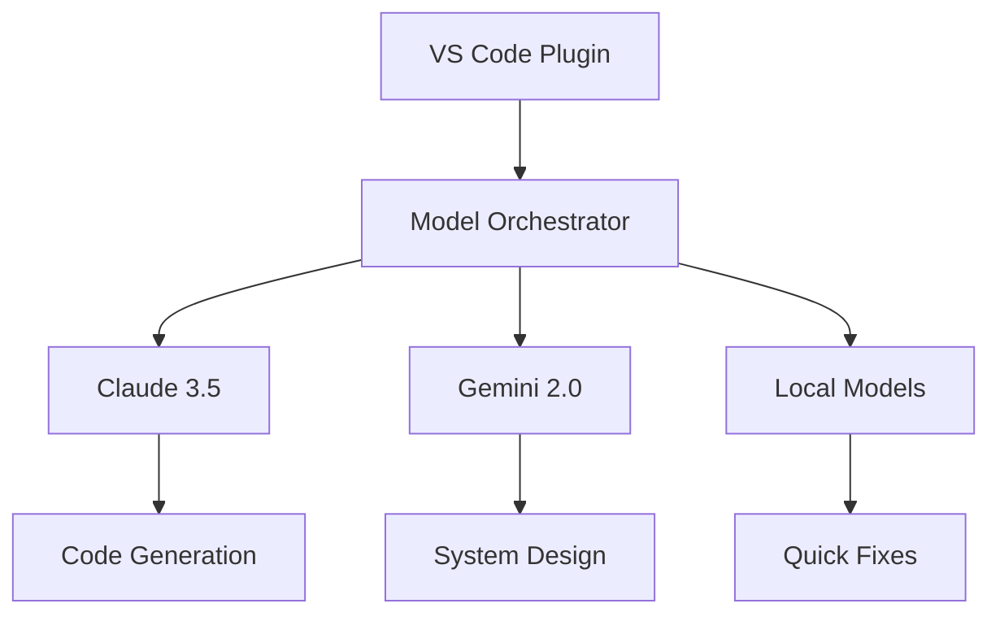

# Professional Full-Stack Development Guide: ASP.NET Core + React + Cline AI  
**Enterprise-Grade Architecture, SOLID Principles & Modern AI Workflows**  

---

## Table of Contents  
1. [Solution Architecture & Project Structure](#1-solution-architecture--project-structure)  
2. [ASP.NET Core Backend Implementation](#2-aspnet-core-backend-implementation)  
3. [React Frontend Architecture](#3-react-frontend-architecture)  
4. [Full-Stack Integration Patterns](#4-full-stack-integration-patterns)  
5. [Cline AI: Architecture & Implementation](#5-cline-ai-architecture--implementation)  
6. [SOLID Principles in Practice](#6-solid-principles-in-practice)  
7. [GoF Design Patterns Applied](#7-gof-design-patterns-applied)  
8. [DevOps & CI/CD Pipelines](#8-devops--cicd-pipelines)  
9. [Security & Testing Strategies](#9-security--testing-strategies)  
10. [Learning Resources](#10-learning-resources)  

---

## 1. Solution Architecture & Project Structure  

### Clean Architecture with Vertical Slices  
```markdown
MyEnterpriseApp/  
├── src/  
│   ├── Core/                 # Domain models, interfaces  
│   ├── Application/          # Use cases, CQRS  
│   ├── Infrastructure/       # EF Core, Identity, Caching  
│   ├── WebApi/               # ASP.NET Core (Minimal APIs)  
│   └── ClientApp/            # React frontend  
│       ├── public/           # Static assets  
│       ├── src/  
│           ├── features/     # Feature slices (products, users)  
│           ├── lib/          # Utility classes, API clients  
│           ├── app/          # Root components, routing  
│           └── types/        # TypeScript interfaces  
├── tests/  
│   ├── UnitTests/            # xUnit/NUnit tests  
│   └── IntegrationTests/     # API + React testing  
└── docs/                     # ADRs, OpenAPI specs  
```

**Key Conventions**:  
- **C#**: `PascalCase` classes, `_camelCase` private fields  
- **React**: Feature-first organization, custom hooks for business logic  
- **Testing**: 80%+ coverage, contract testing for APIs  

---

## 2. ASP.NET Core Backend Implementation  

### CQRS with MediatR  
```csharp
// Products.cs (Vertical Slice)
app.MapGet("/products", async (ISender mediator) => 
    Results.Ok(await mediator.Send(new GetProductsQuery())))
    .Produces>(StatusCodes.Status200OK)
    .WithTags("Products");
```

### Repository Pattern  
```csharp
public class EfRepository : IRepository where T : BaseEntity 
{
    private readonly AppDbContext _context;
    
    public EfRepository(AppDbContext context) => _context = context;
    
    public async Task GetByIdAsync(int id) => 
        await _context.Set().FindAsync(id);
}
```

---

## 3. React Frontend Architecture  

### Component Structure with Zustand  
```tsx
// features/products/ProductList.tsx
export const ProductList = () => {
  const { products } = useProductStore();
  
  return (
    
      {products?.map(product => (
        
      ))}
    
  );
};
```

### State Management  
```ts
// stores/useProductStore.ts
import create from 'zustand';

interface ProductState {
  products: ProductDto[];
  fetchProducts: () => Promise;
}

export const useProductStore = create((set) => ({
  products: [],
  fetchProducts: async () => {
    const response = await api.getProducts();
    set({ products: response.data });
  }
}));
```

---

## 4. Full-Stack Integration Patterns  

### JWT Authentication Flow  
```csharp
// ASP.NET Core Startup
services.AddAuthentication(JwtBearerDefaults.AuthenticationScheme)
    .AddJwtBearer(options => {
        options.TokenValidationParameters = new TokenValidationParameters {
            ValidIssuer = Configuration["Jwt:Issuer"],
            ValidAudience = Configuration["Jwt:Audience"],
            IssuerSigningKey = new SymmetricSecurityKey(
                Encoding.UTF8.GetBytes(Configuration["Jwt:Key"]))
        };
    });
```

```ts
// React Auth Context
const AuthProvider = ({ children }) => {
  const [user, setUser] = useState(null);

  const login = async (credentials: LoginDto) => {
    const response = await api.post('/auth/login', credentials);
    localStorage.setItem('token', response.data.token);
    setUser(response.data.user);
  };

  return (
    
      {children}
    
  );
};
```

---

## 5. Cline AI: Architecture & Implementation  

### Core Architecture  


### Key Features  
1. **Model Flexibility**:  
   ```python
   # Cost-optimized model routing
   if task.complexity > 0.7:
       use_model("claude-3.5-sonnet")
   else:
       use_model("deepseek-r1")
   ```
   
2. **System Interaction**:  
   ```bash
   cline execute-command "docker compose up --build"
   └> Monitoring container logs...
   └> Auto-fixing port conflicts
   ```

3. **Browser Automation**:  
   ```typescript
   await page.goto('https://staging.example.com');
   await page.fill('#email', 'test@example.com');
   ```

### Security Controls  
```diff
// Code change review
- const apiURL = 'http://localhost:3000';
+ const apiURL = process.env.API_URL;
```
**Audit Trail**:  
```log
[2025-05-15 15:34] Modified: src/middleware/auth.js  
  - Model: claude-3.5-sonnet  
  - Cost: $0.0085  
```

---

## 6. SOLID Principles in Practice  

### Dependency Inversion  
```tsx
// API Context Provider
const ApiContext = createContext(new ApiClient());

export const ApiProvider = ({ children }) => {
  const client = new ApiClient(process.env.API_URL);
  return (
    
      {children}
    
  );
};
```

### Interface Segregation  
```csharp
public interface IReadRepository {
    Task GetByIdAsync(int id);
    Task> ListAsync();
}

public interface IWriteRepository {
    Task AddAsync(T entity);
    Task UpdateAsync(T entity);
}
```

---

## 7. GoF Design Patterns Applied  

### Factory Method  
```tsx
// Component Factory
export const ProductComponentFactory = {
  create: (type: 'card' | 'list') => {
    switch(type) {
      case 'card': return ProductCard;
      case 'list': return ProductList;
      default: throw new Error('Invalid type');
    }
  }
};
```

### Observer Pattern  
```ts
// Observable.ts
class Observable {
  private observers: ((value: T) => void)[] = [];

  subscribe(observer: (value: T) => void) {
    this.observers.push(observer);
  }

  notify(value: T) {
    this.observers.forEach(observer => observer(value));
  }
}
```

---

## 8. DevOps & CI/CD Pipelines  

### GitHub Actions Workflow  
```yaml
name: Build & Deploy

on: [push]

jobs:
  build:
    runs-on: windows-latest
    steps:
    - uses: actions/checkout@v4
    - name: Setup .NET
      uses: actions/setup-dotnet@v3
      with:
        dotnet-version: 8.0.x
    - name: Build Backend
      run: dotnet build --configuration Release
    - name: Build Frontend
      working-directory: ClientApp
      run: npm run build
```

---

## 9. Security & Testing Strategies  

### React Security  
```tsx
// Content Sanitization

```

### Testing Pyramid  
```csharp
// API Contract Test
[Fact]
public async Task GetProducts_ReturnsSuccessStatusCode()
{
    var response = await _client.GetAsync("/api/products");
    response.EnsureSuccessStatusCode();
}
```

---

## 10. Learning Resources  

### Essential Materials  
| Type | Resource |  
|------|----------|  
| **ASP.NET Core** | [Microsoft Learn](https://learn.microsoft.com/aspnet/core) |  
| **React** | [React Beta Docs](https://beta.reactjs.org/) |  
| **Cline AI** | [Official Documentation](https://docs.cline.ai) |  

### Tooling Recommendations  
```markdown
- **IDE**: Visual Studio 2022 + VS Code  
- **Testing**: Playwright, xUnit  
- **Monitoring**: Application Insights  
```
